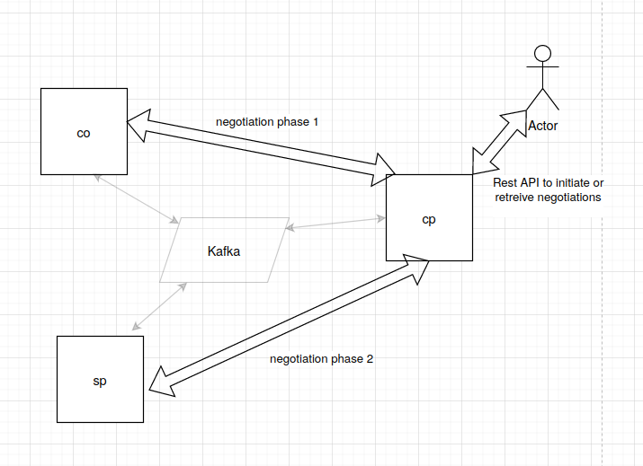

# What's in This repo

We have 3 organisations co, cp and sp. These 3-organisation exchange messages asynchronously through a Kafka broker. The goal of these organisations is to negotiate a distribution contract.




# Prerequisites

- Java 11
- maven
- docker
- docker compose
# Running

To run the code, type

`make run`

This will trigger docker compose to create the Kafka/Zookeeper broker and 3 quarkus containers: co, sp and cp.

# Testing

The CP accepts POST on its /content path to initiate negotiations:

```bash
curl -H "Content-type: application/json" -X POST localhost:8082/content -d '{"contentId":18,"price":10}' -v -s
*   Trying 127.0.0.1...
* TCP_NODELAY set
* Connected to localhost (127.0.0.1) port 8082 (#0)
> POST /content HTTP/1.1
> Host: localhost:8082
> User-Agent: curl/7.58.0
> Accept: */*
> Content-type: application/json
> Content-Length: 27
> 
* upload completely sent off: 27 out of 27 bytes
< HTTP/1.1 202 Accepted
< content-length: 0
< 
* Connection #0 to host localhost left intact

```
Successful negotiations are visible in the /negotiation endpoint

```bash
curl localhost:8082/negotiations -s | jq .
[
  {
    "contentId": "18",
    "price": 10,
    "spAgreed": true,
    "cpcoMessageNegotiation": {
      "contentId": "18",
      "price": 10,
      "cpAgreed": true,
      "coAgreed": true
    },
    "cpAgreed": true
  }
]
```

# Building

Components can be built from the command line:

```make build```

# Developing

Load the parent pom from the root of the directory into intelliJ. Configure each project to run on quarkus [following the documentation](https://www.jetbrains.com/help/idea/quarkus.html#new_microservice_project). Once the three projects are loaded into intellij (you may need to type `mvn install` at the root of the repo to install dependencies locally), you can run/debug them locally. There's no need to start a Kafka broker locally, since it will be done by quarkus.

The three cp/co/sp projects depends on the commons project, which provides POJO that will be exchanged as json between the components.

The classes are separated by packages as:

* neli.camel: camel routes configurations
* neli.services: business for each project
* neli.rest: REST api definition

