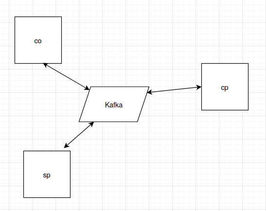

# What's in this repo

We have 3 organizations co, cp and sp. These 3 organizations exchange messages asynchronously through a kafka broker. The goal for these organizations is to negociate a distribution contract.



# Prerequisites

- Java 11
- maven
- docker
- docker compose
# Running

To run the code, type

`make run`

this will trigger docker compose to create the Kafka/Zookeeper broker and 3 quarkus containers: co, sp and cp.

# Testing

The CP accepts POST on its /content path to initiate negociation:

`curl -H "Content-type: application/json" -X POST localhost:8082/content -d '{"contentId":18,"price":10}' -v`

Sucessful negociations are visible in the /negotiation endpoint

```bash
curl localhost:8082/negotiations -s | jq .
[
  {
    "contentId": "18",
    "price": 10,
    "spAgreed": true,
    "cpcoMessageNegotiation": {
      "contentId": "18",
      "price": 10,
      "cpAgreed": true,
      "coAgreed": true
    },
    "cpAgreed": true
  }
]
```

# Building

Components can be built from the command line:

```make build```

# Developping

Load the parent pom from the root of the directory into intelliJ. Configure each project to run on quarkus [following the documentations](https://www.jetbrains.com/help/idea/quarkus.html#new_microservice_project). Once the three projects are loaded into intellij (you may need to type `mvn install` at the root of the repo to install dependencies locally)

The three cp/co/sp projects depends on the commons project, which provides POJO that will be echanged as json between the components.

The classes are separated by packages as:

* neli.camel: camel routes configurations
* neli.services: business for each project
* neli.rest: REST api defintion

